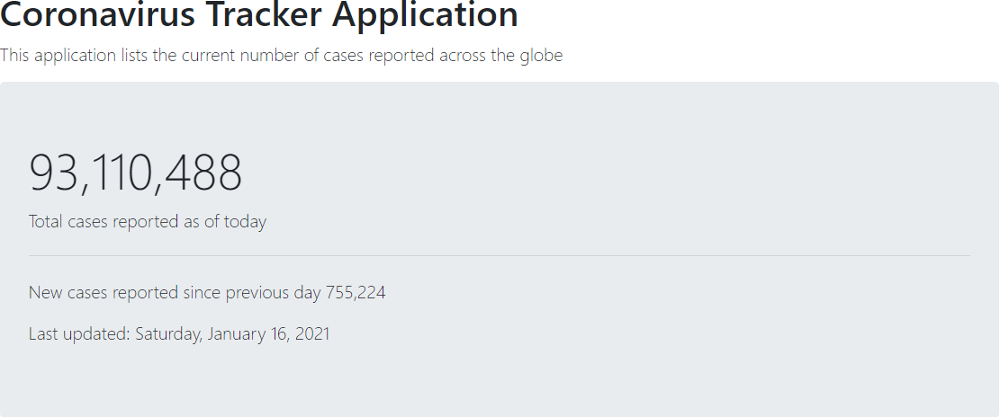

Welcome to Dwight's Java Portfolio! Below are some of the applications that I have created/worked on using Java!

## 1. [Coronavirus Tracker App](https://covid-19-springboot-tracker.herokuapp.com/)

This project was created using **Spring Boot**. 

This application parses a CSV file and uses the Thymeleaf dependancy to format and display the data on a webpage. [View My Code](https://github.com/dmcleish91/covid-19-tracker)

## 1. JavaFX Contacts App

This project was created using **JavaFX**. 

This application allows a user to manage a contacts list which is saved and loaded from an XML file. [View My Code](https://github.com/dmcleish91/JavaFX-Contacts-Application)

